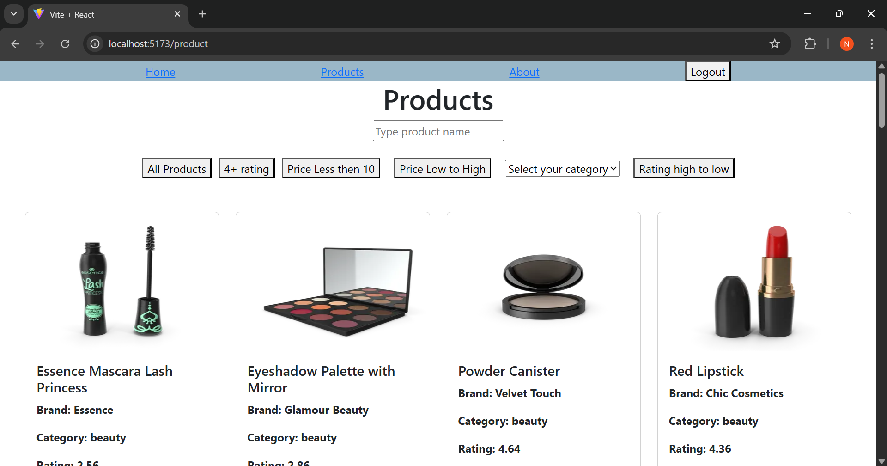
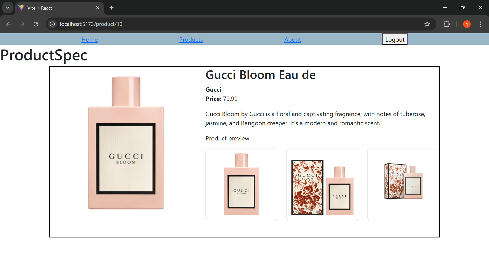

# 🛍️ Product Listing App - React + API

A responsive React application that displays a list of products using the DummyJSON API. Includes features like search, category filtering, sorting, login-protected routes, and dynamic product details with image previews.

---

## 🚀 Features

- 🔍 Search products by name
- 🎯 Filter by category
- 💰 Sort by price and rating
- 🔐 Route protection based on login status
- 🖼️ Detailed product view with image gallery
- 📱 Responsive UI with Bootstrap 5

---

## 🛠️ Technologies Used

- React.js
- JavaScript (ES6+)
- Axios
- React Router v6
- Bootstrap 5
- DummyJSON API

---

## 📸 Screenshots

### Products


### Product-Details


---

## 🌐 Live Demo

[👉 View Live App](https://your-live-demo-link.vercel.app)  
(Replace with your deployed URL)

---

## 📦 Installation (Run Locally)

```bash
git clone https://github.com/yourusername/product-listing-app.git
cd product-listing-app
npm install
npm run dev
